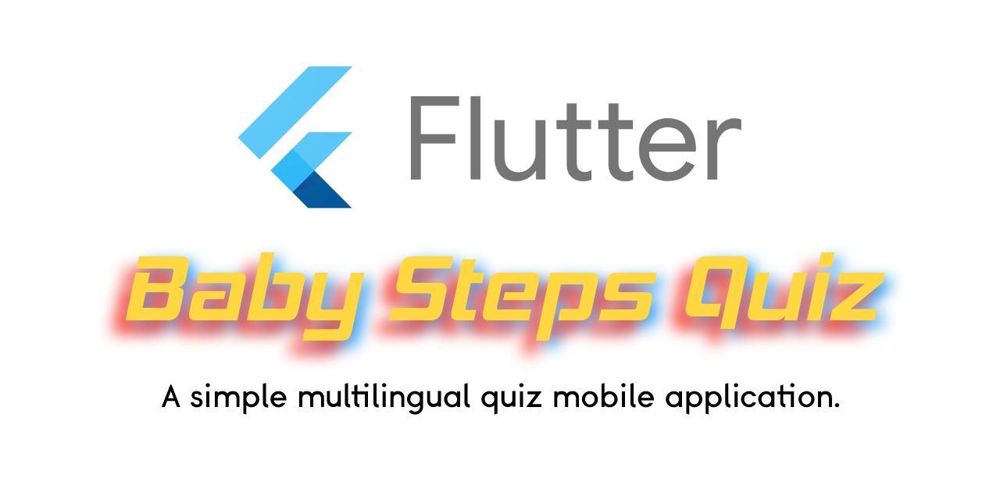
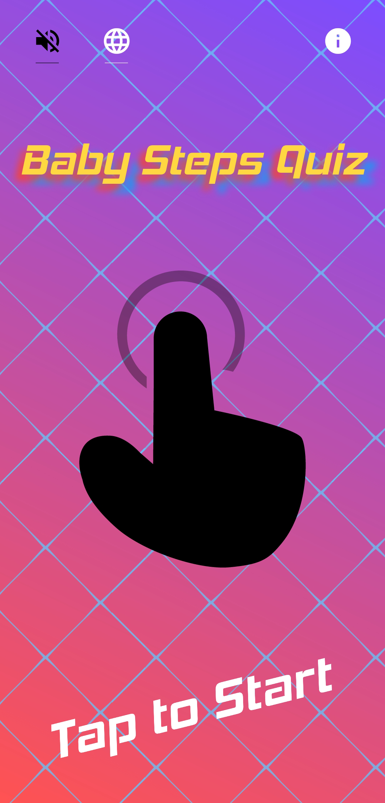
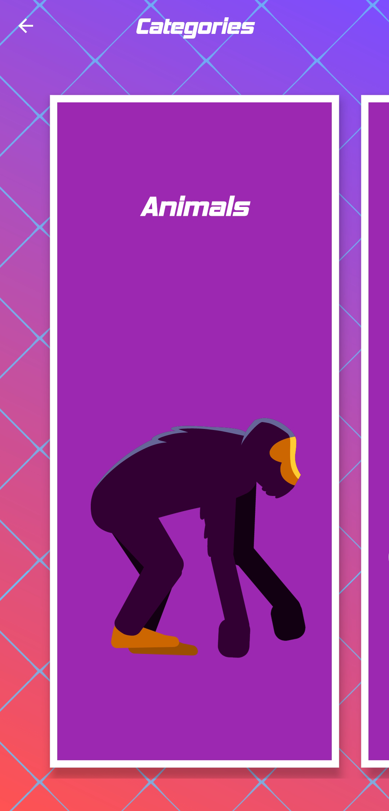
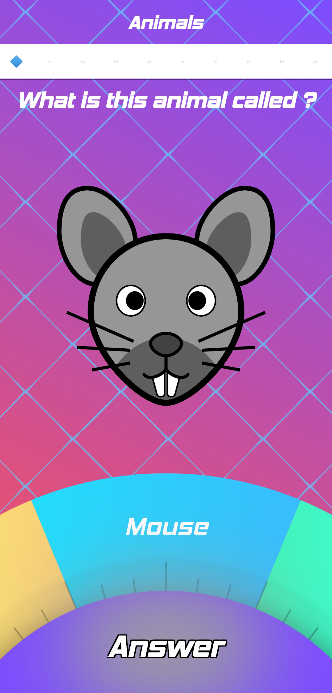
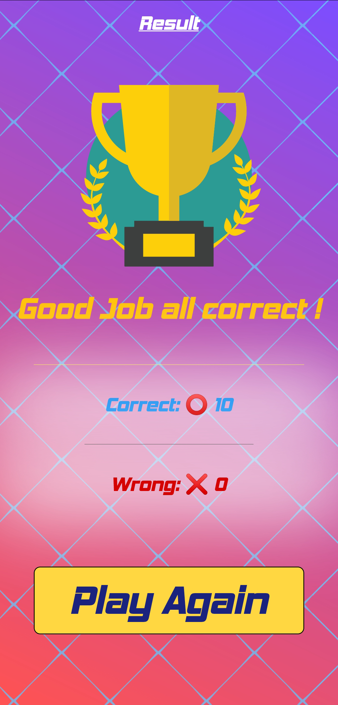

# Baby Steps Quiz




This is a flutter project of a simple multilingual (EN, FR, ES, AR) Quiz App.

## 📸 Screenshots
Screenshot1 | Screenshot2 | Screenshot3 | Screenshot4
:-------------------------:|:-------------------------:|:-------------------------:|:-------------------------:
 | |  | 

## 🏁 Getting Started

These instructions will get you a copy of the project up and running on your local machine for development and testing purposes.

### Prerequisites

```
flutter
```

### Installing

Steps:

```
Clone/ Download the repository
```

And install the packages from the command line:

```
flutter pub get
```

## Built With

* [Flutter](https://flutter.dev/) - The mobile framework used.
* [Audioplayers](https://github.com/luanpotter/audioplayers) - A Flutter plugin to play multiple simultaneously audio files.
* [Flare Flutter](https://github.com/2d-inc/Flare-Flutter) - Load and get full control of your Flare files in a Flutter project using this library.
* [Url Launcher](https://github.com/flutter/plugins/tree/master/packages/url_launcher) - A Flutter plugin for launching a URL in the mobile platform.
* [Shared Preferences](https://github.com/flutter/plugins/tree/master/packages/shared_preferences) - Wraps NSUserDefaults (on iOS) and SharedPreferences (on Android), providing a persistent store for simple data.
* [Flutter Svg](https://github.com/dnfield/flutter_svg) - Draw SVG (and some Android VectorDrawable (XML)) files on a Flutter Widget.
* [Flutter Launcher Icons](https://github.com/fluttercommunity/flutter_launcher_icons) - A command-line tool which simplifies the task of updating your Flutter app's launcher icon.

## Authors

* **Skender Lahdhiri** - *Initial work* - [Skenderl](https://github.com/skenderl)

## Acknowledgments

### Inspirations

* [FLX](https://github.com/HossamElghamry/FLX)
* [Review Page Interaction](https://github.com/supermarcos/flutter-review-page-iteraction)
* [Widget Quiz](https://github.com/mono0926/widget-quiz)
* [Review Page Interaction](https://github.com/supermarcos/flutter-review-page-iteraction)

### Assets

**SVGs used:**

* [BomSymbols](https://www.iconfinder.com/korawan_m)
* [Webalys](https://www.iconfinder.com/webalys)
* [Paolo Valzania](https://www.iconfinder.com/Spot)
* [Thiago Silva](https://www.iconfinder.com/thiagopontes)
* [icon lauk](https://www.iconfinder.com/andhikairfani)
* [goodware std.](https://www.iconfinder.com/goodware)

**Flares used:**

* [Gaston](https://www.2dimensions.com/a/budindepan)
* [Domobile](https://www.2dimensions.com/a/domo)
* [James Testou](https://www.2dimensions.com/a/ytesti)
* [Prakash George](https://www.2dimensions.com/a/prakash)
* [JcToon](https://www.2dimensions.com/a/JuanCarlos)
* [Guido Rosso](https://www.2dimensions.com/a/pollux)

## License

This project is licensed under the MIT License - see the [LICENSE.md](LICENSE.md) file for details
